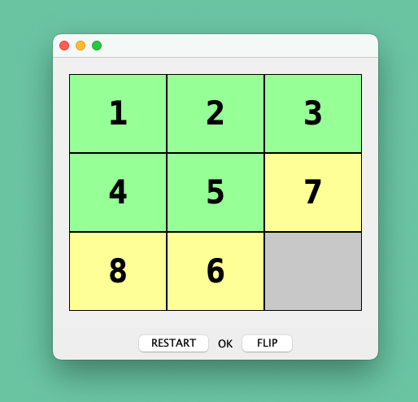
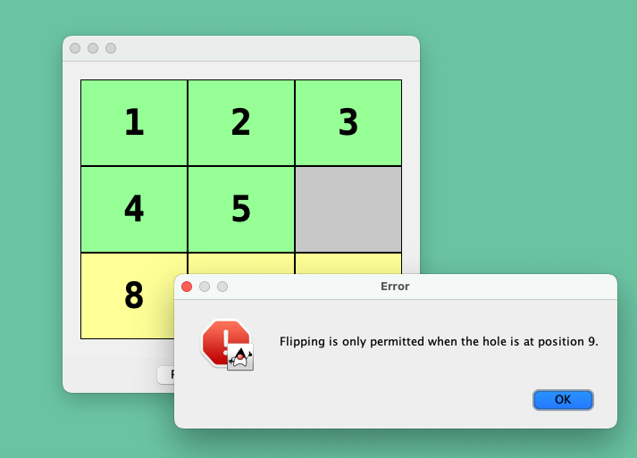
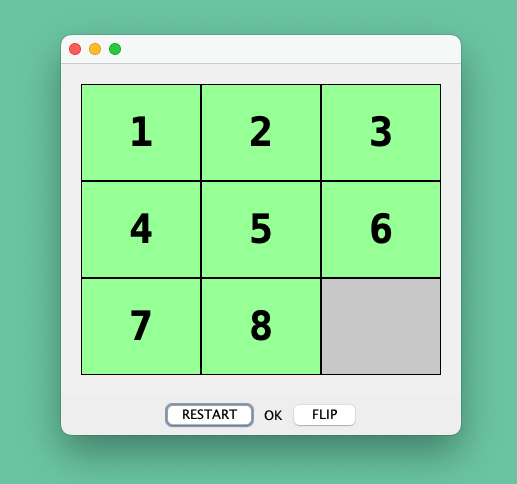

# Eight Puzzle
UniPi, Advanced Programming, first assignment
Emanuele Buonaccorsi, 598855

---

To build and run using Maven: `mvn exec:java`

## Design overview

`EightBoard`:
- When instantiated, the board creates instances for every tile needed and the controller, making sure to register the veto listeners.

`EightTile`:
- Each tile, when clicked, will try to change its position to 9 (the hole), unless the controller vetoes the request via an event.

`EightController`: 
- The controller keeps a reference to the tile that represents the current hole.
- The controller can veto the request of a tile to be moved by checking if that tile is next to the hole.


## Flip operation

The flip button is a JButton initialized inside `EightBoard`. In the same class, a method handles the flip operation by delegating part of the checking of the tiles' positioning to the controller (`EightController`).

```java
    private void flipTiles() {
        // ...
        try{
            // asks the controller to check if the hole is at position 9
            if (!controller.isHoleAtPositionNine()) {
                throw new IllegalStateException("Hole is not at position 9.");
            }
            // ...
        }
        // ...
    }
        
```


# Screenshots



